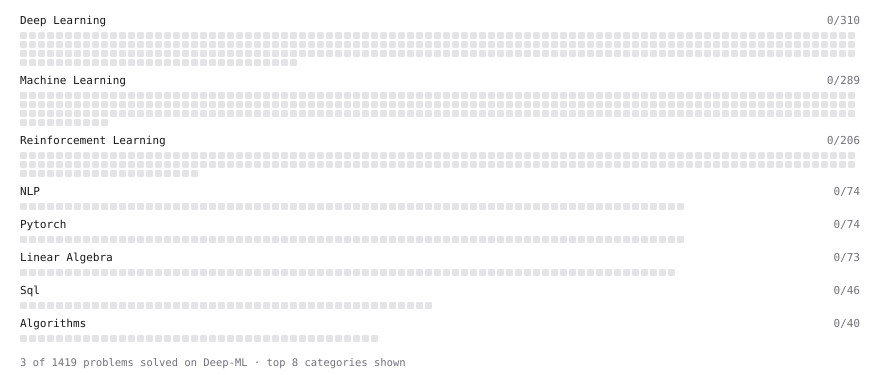

# Deep-ML

My machine learning practice from [Deep-ML](https://www.deep-ml.com). Every solution here was written by hand.

**6** solved · 6 problems · 0 labs · 0 math

[**Browse the interactive portfolio**](https://alb816.github.io/deep-ml/) to replay this filling in over time.

## Problems

| | Difficulty | Solved | |
| --- | --- | --- | --- |
| [Calculate Conditional Probability from Data](https://www.deep-ml.com/problems/168) | easy | 2026-09-19 | [solution](problems/0168-calculate-conditional-probability-from-data) |
| [Derivative of a Polynomial](https://www.deep-ml.com/problems/116) | easy | 2026-09-19 | [solution](problems/0116-derivative-of-a-polynomial) |
| [Poisson Distribution Probability Calculator](https://www.deep-ml.com/problems/81) | easy | 2026-09-19 | [solution](problems/0081-poisson-distribution-probability-calculator) |
| [Binomial Distribution Probability](https://www.deep-ml.com/problems/79) | medium | 2026-09-19 | [solution](problems/0079-binomial-distribution-probability) |
| [Find Captain Redbeard's Hidden Treasure](https://www.deep-ml.com/problems/127) | medium | 2026-09-17 | [solution](problems/0127-find-captain-redbeard-s-hidden-treasure) |
| [Quotient Rule for Derivatives](https://www.deep-ml.com/problems/312) | medium | 2026-09-18 | [solution](problems/0312-quotient-rule-for-derivatives) |

---

_This file is regenerated by Deep-ML on every push._
